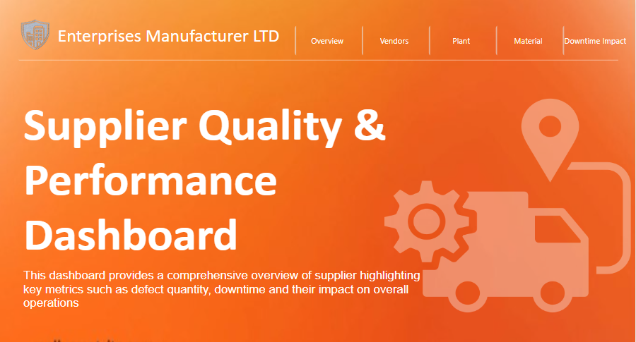
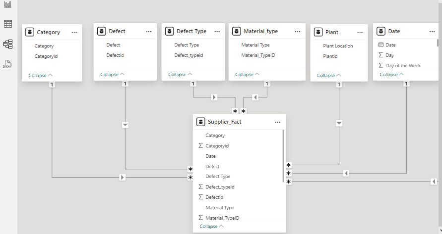
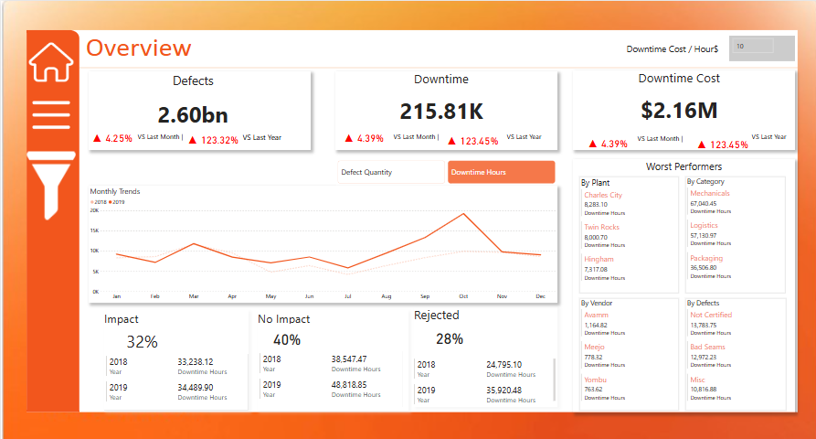
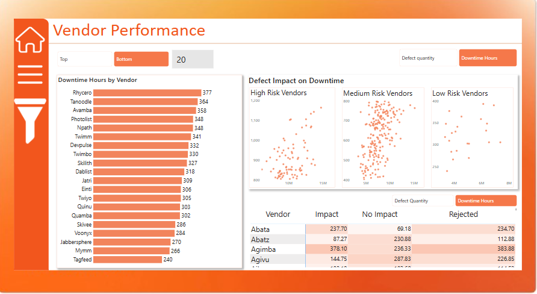
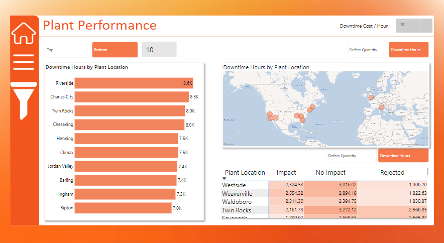
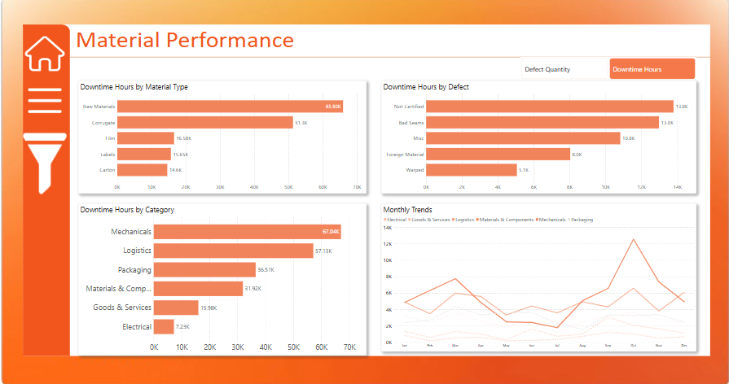
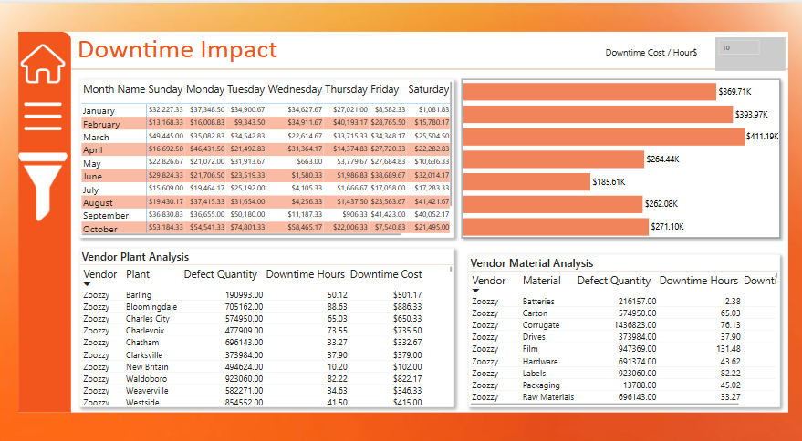

# Supplier Quality & Performance Dashboard
-----

This report provides a comprehensive overview of supplier quality, highlighting key metrics such as defect quantity, downtime, and their impact on overall operations at **Enterprise Manufacturers Ltd.** The goal is to identify which vendors, materials, and plants are underperforming to improve operational efficiency and reduce costs.

---

**Data Cleaning and Transformation**:
   - No duplicate records found
   -  Verified data consistency, ensuring the correct mapping of vendor names, material types, and plant locations
   - Created a new `Date` table using a **DAX function**, allowing detailed time-based analysis.
   - Established relationships between tables (vendors, plants, materials, defects) using **VendorID**

Below is the data model representing the relationships between **Vendors**, **Plants**, **Materials**, and **Defects** tables.
 This model is crucial for performing accurate analysis and gaining insights from the dataset.
 

------
## Skills Used

- **Data Cleaning & Transformation**
- **Data Modeling**
- **Data Analysis**
- **Data Visualization**
- **DAX Functions**

## Key Insights

### 1. Total Defects and Downtime

- **Defect Quantity**: 
  - The total defect quantity across all vendors and materials is **2.60 billion**.
  
- **Downtime Hours**:
  - The defects caused a cumulative **215.81K downtime hours**, significantly affecting productivity.
  
- **Downtime Cost**:
  - The downtime has resulted in a financial impact of **$2.16 million**. This reflects a substantial cost due to production delays and inefficiencies.
- **Monthly Downtime Trends**:
  - **Mid-Year Spike**: A noticeable increase in downtime and defect quantities was observed around May to July.
  - **Highest Monthly Downtime**: October showed the highest downtime costs with a peak of **$74,801** in lost production.
    

### 2. Worst Performing Vendors and Plants

- **Vendors Causing the Greatest Downtime**:
  - **Avamm**: 1,164.82 hours of downtime.
  - **Meejo**: 778.32 hours of downtime.
  - **Yombu**: 763.62 hours of downtime.

- **Plants with the Greatest Downtime**:
  - **Charles City**: 8,283.10 hours of downtime.
  - **Twin Rocks**: 8,000.70 hours of downtime.
  - **Hingham**: 7,317.08 hours of downtime.

###
 Vendor                   |                                      Plant                                
:------------------------------|-----------------------------------------------:         
  |                       
---

### 3. Material and Vendor Combination Performance

- The combination of specific vendors and materials shows areas of concern:
  - **Zoozzy** and **Corrugate**: Highest defect quantity at 1.43M and 76.13 downtime hours.
  - **Zoozzy** and **Film**: Second highest defect quantity at 947K with 131.48 downtime hours.

--- 

### 4. Defect Types and Their Impact

- **Top Defect Categories**:
  - **Mechanicals**: Caused **67,040.45 hours** of downtime, representing the largest contributor.
  - **Logistics**: Contributed **57,130.97 hours** of downtime.
  - **Packaging**: Led to **36,506.80 hours** of downtime.

- **Top Defect Types**:
  - **Not Certified**: 13,783.75 downtime hours.
  - **Bad Seams**: 12,972.23 downtime hours.
  - **Miscellaneous**: 10,816.88 downtime hours.
  - 
    ### Vendor and Plant Combination Performance
    
- A cross-analysis of vendors and plant performance shows that some vendors consistently perform poorly across different plants:
  - **Zoozzy** at **Waldoboro**: 923K defect quantity with 82.22 downtime hours.
  - **Zoozzy** at **Weaverville**: 582K defect quantity with 34.63 downtime hours
  - 
    

---

## Conclusion

The analysis of supplier performance shows significant opportunities for improvement in both vendor selection and plant operations. The greatest contributors to downtime are mechanical issues and specific vendors, such as **Zoozzy** and **Avamm**, which should be further investigated to reduce defects and downtime costs.

By focusing on underperforming vendors and materials, **Enterprise Manufacturers Ltd.** can optimize their supply chain processes, minimize downtime, and save costs in the future.

---

